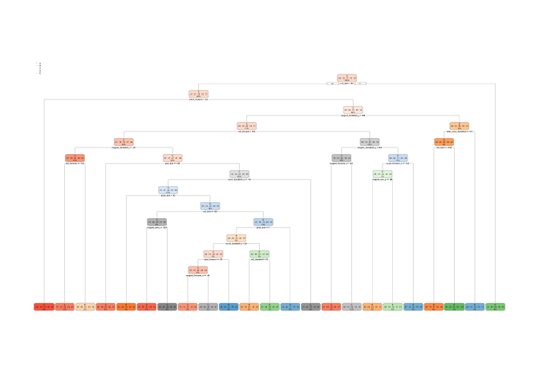

# Machine Learning Project - Human Activity Prediction
Jianlei Sun, November 10 2016  


## Dataset Information

Using devices such as Jawbone Up, Nike FuelBand, and Fitbit it is now possible to collect a large amount of data about personal activity relatively inexpensively. These type of devices are part of the quantified self movement – a group of enthusiasts who take measurements about themselves regularly to improve their health, to find patterns in their behavior, or because they are tech geeks. One thing that people regularly do is quantify how much of a particular activity they do, but they rarely quantify how well they do it. In this project, your goal will be to use data from accelerometers on the belt, forearm, arm, and dumbell of 6 participants. They were asked to perform barbell lifts correctly and incorrectly in 5 different ways. More information is available from the website here: http://groupware.les.inf.puc-rio.br/har (see the section on the Weight Lifting Exercise Dataset).


- The training data for this project are available here:

https://d396qusza40orc.cloudfront.net/predmachlearn/pml-training.csv

- The test data are available here:

https://d396qusza40orc.cloudfront.net/predmachlearn/pml-testing.csv

## Problem Statement

The goal of your project is to predict the manner in which they did the exercise. This is the "classe" variable in the training set. You may use any of the other variables to predict with. You should create a report describing how you built your model, how you used cross validation, what you think the expected out of sample error is, and why you made the choices you did. You will also use your prediction model to predict 20 different test cases.

Your submission for the Peer Review portion should consist of a link to a Github repo with your R markdown and compiled HTML file describing your analysis. Please constrain the text of the writeup to < 2000 words and the number of figures to be less than 5. It will make it easier for the graders if you submit a repo with a gh-pages branch so the HTML page can be viewed online (and you always want to make it easy on graders :-).

## 1. Data download, cleaning and transformation

### 1.1 Load libraries


```r
library(caret)
```

```
## Loading required package: lattice
```

```
## Loading required package: ggplot2
```

```r
library(rpart); library(rpart.plot)
library(lattice)
library(randomForest)
```

```
## randomForest 4.6-12
```

```
## Type rfNews() to see new features/changes/bug fixes.
```

```
## 
## Attaching package: 'randomForest'
```

```
## The following object is masked from 'package:ggplot2':
## 
##     margin
```

```r
set.seed(1234)
```

### 1.2 Download the dataset


```r
trainUrl <- "http://d396qusza40orc.cloudfront.net/predmachlearn/pml-training.csv"
testUrl <- "http://d396qusza40orc.cloudfront.net/predmachlearn/pml-testing.csv"

nameTraining <- "pml-training.csv"

if (file.exists(nameTraining)) {
        training <- read.csv(nameTraining, na.strings=c("NA","#DIV/0!",""))
} else { 
        download.file(trainUrl,nameTraining)
        training <- read.csv(nameTraining, na.strings=c("NA","#DIV/0!",""))
        }                           

nameTesting <-  "pml-testing.csv"

if (file.exists(nameTesting)) {
        testing <- read.csv(nameTesting, na.strings=c("NA","#DIV/0!",""))
} else { 
        download.file(testUrl,nameTesting)
        testing <- read.csv(nameTesting, na.strings=c("NA","#DIV/0!",""))
}   
```

### 1.3 Clean and transform the dataset

Remove variables with NA values, and remove the first seven columns that are not related to the results:


```r
training<-training[,colSums(is.na(training)) == 0]
testing <-testing[,colSums(is.na(testing)) == 0]

training   <-training[,-c(1:7)]
testing <-testing[,-c(1:7)]
```

## 2. Cross Validatin and Modeling

### 2.1 Create cross-validation datasets from the training set

- How you used cross validation?

The orginal training set is divided into two parts, one for training ("trainingData") and the other for cross validation ("validationData").


```r
inTrain <- createDataPartition(training$classe, p = 0.75, list = FALSE)
trainingData <- training[inTrain,]
validationData <- training[-inTrain,]
```

### 2.2 Comparision between Decision Tree vs. Random Forest

#### 2.2.1 Decision Tree - Build the prediction model


```r
modelDT <- rpart(classe ~ ., data = trainingData)
# rpart.plot(modelDT, main="Classification Tree", extra=102, under=TRUE, faclen=0)
rpart.plot(modelDT)
```

<!-- -->

#### 2.2.2 Decision Tree - Make prediction


```r
predictDT <- predict(modelDT, validationData, type = "class")
confusionMatrix(predictDT, validationData$classe)
```

```
## Confusion Matrix and Statistics
## 
##           Reference
## Prediction    A    B    C    D    E
##          A 1235  157   16   50   20
##          B   55  568   73   80  102
##          C   44  125  690  118  116
##          D   41   64   50  508   38
##          E   20   35   26   48  625
## 
## Overall Statistics
##                                           
##                Accuracy : 0.7394          
##                  95% CI : (0.7269, 0.7516)
##     No Information Rate : 0.2845          
##     P-Value [Acc > NIR] : < 2.2e-16       
##                                           
##                   Kappa : 0.6697          
##  Mcnemar's Test P-Value : < 2.2e-16       
## 
## Statistics by Class:
## 
##                      Class: A Class: B Class: C Class: D Class: E
## Sensitivity            0.8853   0.5985   0.8070   0.6318   0.6937
## Specificity            0.9307   0.9216   0.9005   0.9529   0.9678
## Pos Pred Value         0.8356   0.6469   0.6313   0.7247   0.8289
## Neg Pred Value         0.9533   0.9054   0.9567   0.9296   0.9335
## Prevalence             0.2845   0.1935   0.1743   0.1639   0.1837
## Detection Rate         0.2518   0.1158   0.1407   0.1036   0.1274
## Detection Prevalence   0.3014   0.1790   0.2229   0.1429   0.1538
## Balanced Accuracy      0.9080   0.7601   0.8537   0.7924   0.8307
```

#### 2.2.3 Random Forest - Build the prediction model


```r
modelRF <- randomForest(classe ~. , data = trainingData)
```

#### 2.2.4 Random Forest - Make prediction


```r
predictRF <- predict(modelRF, validationData, type = "class")
confusionMatrix(predictRF, validationData$classe)
```

```
## Confusion Matrix and Statistics
## 
##           Reference
## Prediction    A    B    C    D    E
##          A 1394    3    0    0    0
##          B    1  944   10    0    0
##          C    0    2  843    6    0
##          D    0    0    2  798    0
##          E    0    0    0    0  901
## 
## Overall Statistics
##                                           
##                Accuracy : 0.9951          
##                  95% CI : (0.9927, 0.9969)
##     No Information Rate : 0.2845          
##     P-Value [Acc > NIR] : < 2.2e-16       
##                                           
##                   Kappa : 0.9938          
##  Mcnemar's Test P-Value : NA              
## 
## Statistics by Class:
## 
##                      Class: A Class: B Class: C Class: D Class: E
## Sensitivity            0.9993   0.9947   0.9860   0.9925   1.0000
## Specificity            0.9991   0.9972   0.9980   0.9995   1.0000
## Pos Pred Value         0.9979   0.9885   0.9906   0.9975   1.0000
## Neg Pred Value         0.9997   0.9987   0.9970   0.9985   1.0000
## Prevalence             0.2845   0.1935   0.1743   0.1639   0.1837
## Detection Rate         0.2843   0.1925   0.1719   0.1627   0.1837
## Detection Prevalence   0.2849   0.1947   0.1735   0.1631   0.1837
## Balanced Accuracy      0.9992   0.9960   0.9920   0.9960   1.0000
```

- Why you made the choices you did?

Random Forest algorithms provide an accuray around 0.995, which is better than that of Decision Tress. Therefore, Random Forest method is used for the prediction on the testing dataset.

- What do you think the expected out of sample error is?

The out-of-sample error is expected less than 0.5% for the Random Forest approach. The 95% CI is between (0.9932, 0.9972).

## 3. Predcition on Testing Dataset.

- Apply prediction model to predict 20 different test cases?
 

```r
predictTesting <- predict(modelRF, testing, type = "class")
predictTesting
```

```
##  1  2  3  4  5  6  7  8  9 10 11 12 13 14 15 16 17 18 19 20 
##  B  A  B  A  A  E  D  B  A  A  B  C  B  A  E  E  A  B  B  B 
## Levels: A B C D E
```


