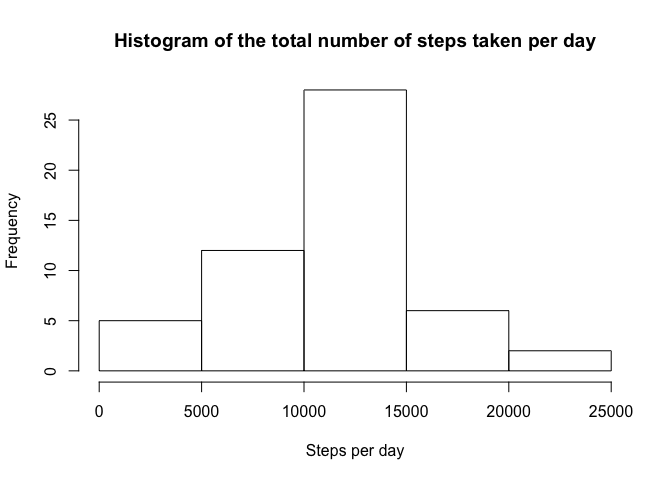
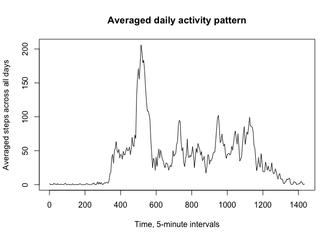
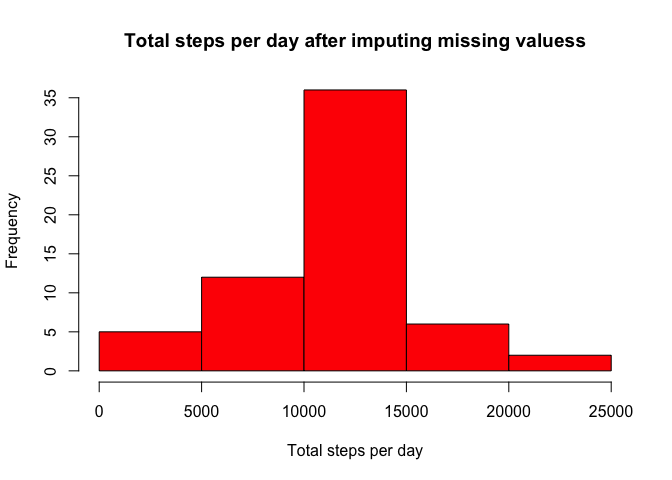
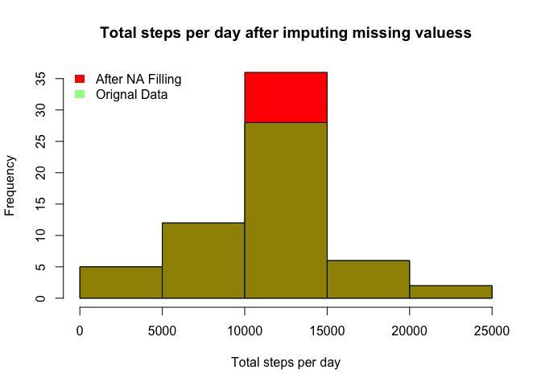
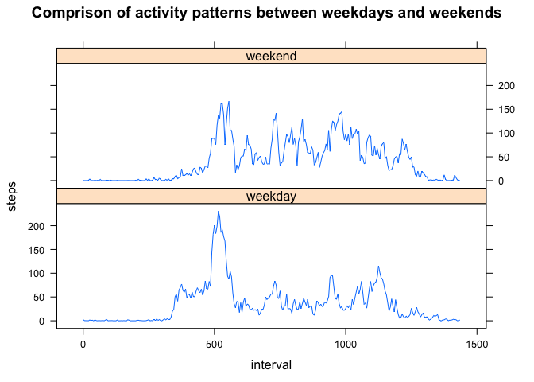

# Personal Movement Activity Monitoring - Reproducible Research Project


*Author: Jianlei (John) Sun Sat Oct 22 2016*

# 1. Introduction to the Project

It is now possible to collect a large amount of data about personal movement using activity monitoring devices such as a Fitbit, Nike Fuelband, or Jawbone Up. These type of devices are part of the “quantified self” movement – a group of enthusiasts who take measurements about themselves regularly to improve their health, to find patterns in their behavior, or because they are tech geeks. But these data remain under-utilized both because the raw data are hard to obtain and there is a lack of statistical methods and software for processing and interpreting the data.

This assignment makes use of data from a personal activity monitoring device. This device collects data at 5 minute intervals through out the day. The data consists of two months of data from an anonymous individual collected during the months of October and November, 2012 and include the number of steps taken in 5 minute intervals each day.

# 2. Raw Data Information

The data for this assignment can be downloaded from the course web site:

Dataset: [Activity monitoring data](https://d396qusza40orc.cloudfront.net/repdata%2Fdata%2Factivity.zip)

The variables included in this dataset are:

* steps: Number of steps taking in a 5-minute interval (missing values are coded as NA)

* date: The date on which the measurement was taken in YYYY-MM-DD format

* interval: Identifier for the 5-minute interval in which measurement was taken

The dataset is stored in a comma-separated-value (CSV) file and there are a total of 17,568 observations in this dataset.

## 3. Loading and preprocessing the data 

### 3.1 Load the data


```r
datainput <- function()
{
    URL <- "https://d396qusza40orc.cloudfront.net/repdata%2Fdata%2Factivity.zip"
    if (!file.exists("dataset.zip")) 
    {
        download.file(URL, "dataset.zip","curl")        
        file <- unzip(destfile)                   
    }
    
    data <- read.csv(file = "activity.csv",head = TRUE,sep = ",")
}
data <- datainput()
```

### 3.2 Process/transform the data into a format suitable for your analysis

Change the "interval" variable to minutes, i.e., change 100, 200, etc to 0. 

For each day, there will be 288 counts of continueous intervals, with each interval eqaul to 5 mintues.


```r
dataTransform <- function(data)
{
    intervals <- seq(0,1435,5)

    cIntervals <- 1
    for(i in 1:nrow(data))
    {
        if (cIntervals > length(intervals)) cIntervals <- 1 
        
        data$interval[i] = intervals[cIntervals]
        cIntervals <- cIntervals + 1
    }
    data        
}
data <- dataTransform(data)
```

## 4. What is mean total number of steps taken per day?

### 4.1 Aggregate/Calcuate the total number of steps by date
        

```r
data1 <- aggregate(steps ~ date, data = data, FUN = sum)
```

### 4.2 Plot the histogram of the total number of steps taken each day


```r
hist(data1$step, xlab = "Steps per day", main = "Histogram of the total number of steps taken per day")
```

<!-- -->

### 4.3 Calculate and report the mean and median total number of steps taken per day

Calculate the mean:

```r
mean(data1$step)
```

```
## [1] 10766.19
```

Calculate the median:

```r
median(data1$step)
```

```
## [1] 10765
```

## 5. What is the average daily activity pattern?

### 5.1 Make a time series plot (i.e. type = "l") of the 5-minute interval (x-axis) and the average number of steps taken, averaged across all days (y-axis)

Compute the averaged steps by intervals:
  

```r
data2 <- aggregate(steps ~ interval, data = data, FUN = mean, na.rm = TRUE)
```

Plot the averaged steps vs. time series of intervals:


```r
plot(data2$steps ~ data2$interval,type = "l", xlab ="Time, 5-minute intervals", ylab="Averaged steps across all days", main="Averaged daily activity pattern")
```

<!-- -->

### 5.2 Which 5-minute interval, on average across all the days in the dataset, contains the maximum number of steps?


```r
data2$interval[which.max(data2$steps)]
```

```
## [1] 515
```

## 6. Imputing missing values

Note that there are a number of days/intervals where there are missing values (coded as NA). The presence of missing days may introduce bias into some calculations or summaries of the data.

### 6.1 Calculate and report the total number of missing values in the dataset (i.e. the total number of rows with NAs)


```r
sum(is.na(data))
```

```
## [1] 2304
```

### 6.2 Devise a strategy for filling in all of the missing values in the dataset. The strategy does not need to be sophisticated. For example, you could use the mean/median for that day, or the mean for that 5-minute interval, etc.

My approach was to use the mean for that 5-minute interval to fill up all the missing values.


```r
dataNAfilling <- function(data, dataMean)
{
    for(i in 1:nrow(data))
    {
        if(is.na(data$steps[i]))
        {
            data$steps[i] = dataMean$steps[dataMean$interval == data$interval[i]]
        }
    }
    data
}
```

### 6.3 Create a new dataset that is equal to the original dataset but with the missing data filled in.


```r
newdata <- dataNAfilling(data, data2)
```

The number of missing values in the new data set equals to zero now.


```r
sum(is.na(newdata))
```

```
## [1] 0
```

### 6.4 Make a histogram of the total number of steps taken each day and Calculate and report the mean and median total number of steps taken per day. Do these values differ from the estimates from the first part of the assignment? What is the impact of imputing missing data on the estimates of the total daily number of steps?

Aggregate/Sum the steps by date.


```r
data3 <- aggregate(steps ~ date, data = newdata, FUN = sum)
```

Plot the histogram of the total number of steps taken per day.


```r
hist(data3$step, xlab = "Total steps per day", col = "red", 
     main = "Total steps per day after imputing missing valuess")
```

<!-- -->

Compute the mean total number of steps taken per day after imputing missing values.


```r
mean(data3$step)
```

```
## [1] 10766.19
```

Compute the median total number of steps taken per day after imputing missing values.


```r
median(data3$step)
```

```
## [1] 10766.19
```

Answer: 

In the first part of the assignment, we obained 10766.19 steps for the mean, and 10765 steps for the median. After imputing missing values, the mean and median steps become 10766.19 and 10766.19, respectively. Therefore, we concluded that the differences are not significant for this case. Because, the "aggregate" function is to neglect missing NA values in default. 

From the following comparision of the two histograms between before and after imputing missing values, we found a very large overlaped region (i.e., yellow region due to overlap of green&red). The difference between the red and green region is due to impuputing missing values.


```r
hist(data3$step, xlab = "Total steps per day", col = "red", 
     main = "Total steps per day after imputing missing valuess")

hist(data1$step, xlab = "Steps per day", col = rgb(0, 1, 0, 0.5), 
     main = "Histogram of the total number of steps taken per day", add = T)

legend('topleft',c('After NA Filling', 'Orignal Data'),
       fill = c("red", rgb(0, 1, 0, 0.5)), bty = 'n', border = NA)
```

<!-- -->

## 7. Are there differences in activity patterns between weekdays and weekends?

For this part the weekdays() function may be of some help here. Use the dataset with the filled-in missing values for this part.

### 7.1 Create a new factor variable in the dataset with two levels – “weekday” and “weekend” indicating whether a given date is a weekday or weekend day.


```r
funWeekdays <- function(data)
{
    data$weekDays <- weekdays(as.Date(data$date))
    for(i in 1:nrow(data))
    {
        if(data$weekDays[i] == "Saturday" | data$weekDays[i] == "Sunday")
        {
            data$weekDays[i] <- "weekend"
        }
        else
        {
            data$weekDays[i] <- "weekday"
        }
    }
    data              
}
data4 <- funWeekdays(newdata)
```

### 7.2 Make a panel plot containing a time series plot (i.e. type = "l") of the 5-minute interval (x-axis) and the average number of steps taken, averaged across all weekday days or weekend days (y-axis). 

Aaggregate the averaged steps by interval and weekday.


```r
data44 <- aggregate(steps ~ interval + weekDays, data = data4, FUN = mean)
```

Plot the averaged number of steps of the 5-minute intervals for both weekday and weekend.


```r
library(lattice)

xyplot(steps ~ interval | weekDays, data = data44, layout=c(1,2), type ="l", main ="Comprison of activity patterns between weekdays and weekends")
```

<!-- -->


